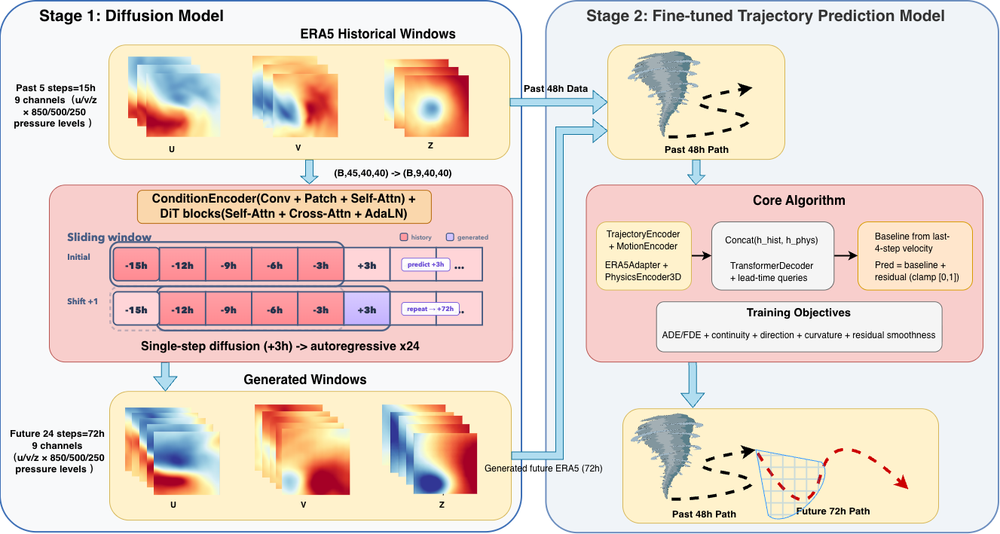
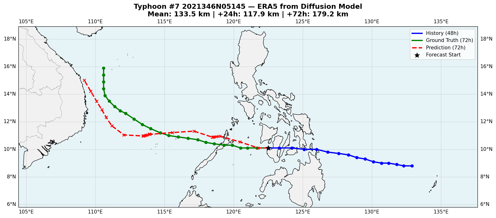
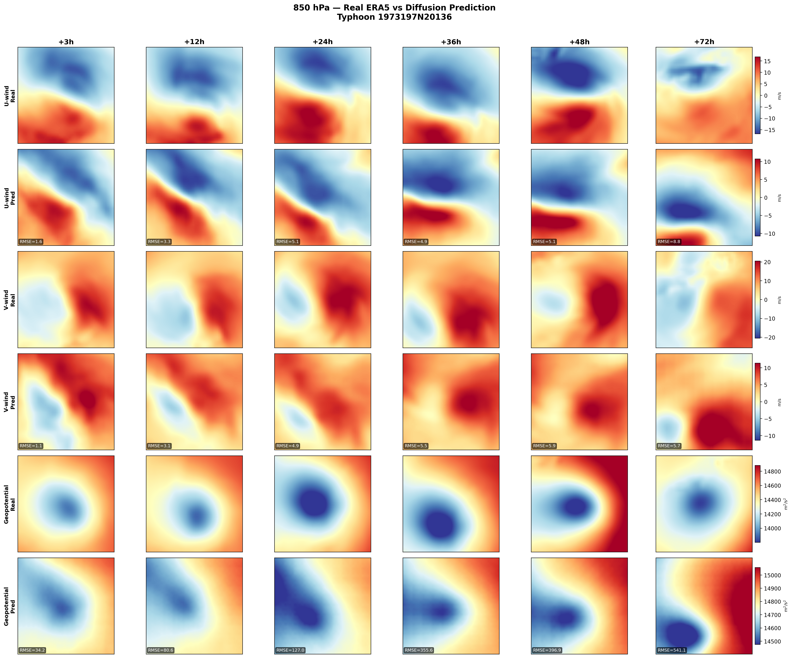
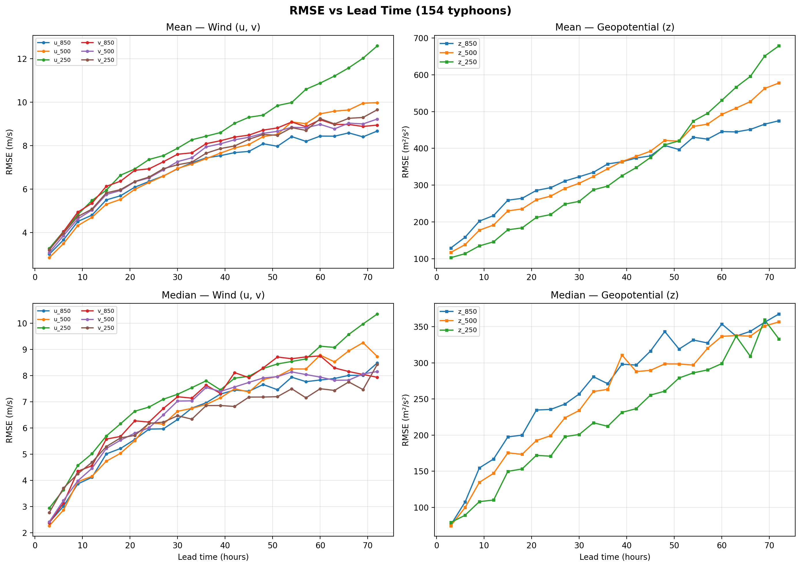

# Spatio-Temporal Diffusion Models for Uncertainty-Aware Typhoon Path Forecasting

Final Year Project, University of Macau  
Supervisor: Prof. Leong Hou U  
Students: Luciano Li, Ka Wai Cheong  
Best Final Year Projects: https://www.cis.um.edu.mo/bestfyp.html

## Overview

This project studies 72-hour typhoon track forecasting with generated future
meteorological guidance. Since real future ERA5 reanalysis is unavailable during
operational forecasting, the system first predicts future ERA5 fields and then
uses them to forecast typhoon trajectories.

The final pipeline contains:

1. **Stage 1: ERA5DiT Generator** - generates future ERA5 meteorological fields.
2. **Stage 2: LT3P-style Trajectory Model** - forecasts typhoon tracks using
   generated ERA5 and past track history.
3. **Ensemble Evaluation** - produces multiple possible trajectories for
   uncertainty-aware forecasting.
4. **DDIM vs Flow Matching Comparison** - compares accuracy and inference speed.

## Pipeline

The end-to-end workflow is:

1. Load historical typhoon tracks from IBTrACS and ERA5 reanalysis fields.
2. Crop storm-centred ERA5 windows on a 40 x 40 grid.
3. Use 5 historical ERA5 frames, covering 15 hours, to generate the next
   3-hour ERA5 frame.
4. Roll out the ERA5 generator for 24 autoregressive steps to obtain 72 hours
   of future atmospheric fields.
5. Feed generated ERA5 and the past 48-hour typhoon trajectory into the
   trajectory model.
6. Produce a 20-member trajectory ensemble and evaluate the ensemble mean error.

## Data

The project uses:

- **ERA5 reanalysis fields** from ECMWF.
- **IBTrACS best-track records** for typhoon trajectories.

ERA5 variables:

- Zonal wind `u`
- Meridional wind `v`
- Geopotential height `z`

Pressure levels:

- 850 hPa
- 500 hPa
- 250 hPa

This gives 9 ERA5 channels in total.

## Model Components

### Stage 1: ERA5DiT Generator

Location: `sources/Code/Diffusion`

Key settings:

- Input: 5 historical ERA5 frames.
- Target: 1 future ERA5 frame.
- Rollout: 24 steps, equal to 72 hours.
- Grid size: 40 x 40.
- Channels: 9.
- Backbone: DiT-style transformer with condition encoding and cross-attention.
- DDIM sampling: 50 steps.

The generator includes condition noise augmentation, scheduled sampling,
channel-weighted loss, z-channel value clamping, ensemble averaging, and
drift-aware fallback for unstable long rollouts.

### Alternative: Conditional Flow Matching

Location: `sources/Code/flow_matching`

This branch keeps the same broad DiT-style backbone but replaces DDIM denoising
with Independent Conditional Flow Matching. It improves inference speed, while
DDIM gives better long-horizon trajectory accuracy in the final evaluation.

### Stage 2: LT3P-Style Trajectory Model

Location: `sources/Code/Trajectory`

Key settings:

- Historical track input: 16 steps, equal to 48 hours.
- Future meteorological input: 24 generated ERA5 steps, equal to 72 hours.
- Output: 24 future latitude-longitude positions.
- ERA5 encoder: 3D convolutional `PhysicsEncoder3D`.
- Track encoder: coordinate embedding and motion encoding.
- Decoder: Transformer decoder with learned future queries.
- Prediction form: residual correction over a linear extrapolation baseline.

The trajectory model is trained with real ERA5 and then fine-tuned with
generated ERA5 to reduce the distribution gap caused by imperfect generated
meteorological fields.

## Results

The main result uses generated ERA5 fields and a fine-tuned trajectory model.
Each case uses 20 generated samples.

### Table 2: Ensemble Mean

Saved result file:
`sources/Code/Trajectory/table2_results/table2_summary.json`

| Lead time | Mean error |
| --------- | ---------: |
| 6 h       |   39.53 km |
| 12 h      |   75.87 km |
| 18 h      |   97.30 km |
| 24 h      |  138.21 km |
| 30 h      |  176.66 km |
| 36 h      |  221.35 km |
| 42 h      |  280.04 km |
| 48 h      |  334.50 km |
| 54 h      |  399.61 km |
| 60 h      |  475.75 km |
| 66 h      |  556.81 km |
| 72 h      |  642.56 km |

Overall mean error: **286.51 km** over 54 evaluated cases.

### Table 3: Oracle Ensemble Potential

Saved result file:
`sources/Code/Trajectory/table3_results/table3_summary.json`

Table 3 uses oracle-style ensemble selection to estimate the potential value of
the generated ensemble. It should not be compared directly with Table 2 because
the aggregation protocol is different.

Overall mean error: **202.89 km** over 54 evaluated cases.

## Key Findings

1. Generated ERA5 provides useful physical guidance for typhoon track
   forecasting, especially at shorter lead times.
2. Fine-tuning on generated ERA5 reduces the distribution gap between real and
   generated meteorological fields.
3. Long-horizon autoregressive error accumulation remains the main limitation.
4. DDIM gives stronger long-range accuracy, while Flow Matching is more
   efficient.
5. Ensemble forecasting is promising, but uncertainty calibration still needs
   further improvement.

## References

- Hersbach et al., "The ERA5 global reanalysis", Quarterly Journal of the Royal
  Meteorological Society, 2020.
- Park et al., "Long-Term Typhoon Trajectory Prediction: A Physics-Conditioned
  Approach Without Reanalysis Data", ICLR, 2024.
- Song et al., "Denoising Diffusion Implicit Models", ICLR, 2021.
- Peebles and Xie, "Scalable Diffusion Models with Transformers", ICCV, 2023.
- Lipman et al., "Flow Matching for Generative Modeling", ICLR, 2023.
- Bi et al., "Pangu-Weather: A 3D High-Resolution Model for Fast and Accurate
  Global Weather Forecast", 2023.
